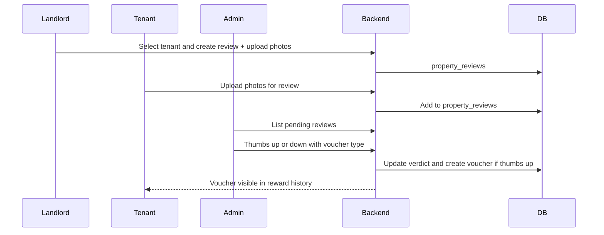

# Property Photo Review — Feature Spec

**Status:** Draft for review  
**Backend:** Python (e.g. FastAPI/Flask)  
**Database:** MongoDB (`rentshield`)  
**Rewards:** Vouchers (e.g. cinema)

---

## 1. Overview

### Purpose

Allow a **landlord** to select a **tenant** to review, upload photos of the property, allow the **tenant** to upload their own photos for the same review, and let an **admin** review all photos and issue a **voucher reward** (e.g. cinema) to the tenant when satisfied (thumbs up). The landlord chooses a tenant (not a property). This is separate from the existing task/submission flow where landlords approve tenant task submissions.

### Roles

| Role     | Responsibility in this feature                                      |
| -------- | -------------------------------------------------------------------- |
| Landlord | Select a tenant to review and upload photos of the property.        |
| Tenant   | Upload photo(s) for a review created for them (optional).           |
| Admin    | Review all photos, give thumbs up or thumbs down; on thumbs up, issue a voucher to the tenant. |

### High-level flow

### Reward rule

- **Thumbs up** → Admin issues a **voucher** (e.g. cinema) to the tenant. Tenant sees it in reward/voucher history.
- **Thumbs down** → No voucher. Review is closed; tenant is not rewarded.

---

## 2. User flows

### 2.1 Landlord: Create review and upload photos

1. Landlord logs in and goes to a “Property reviews” or “Review tenant” area.
2. Landlord **selects a tenant** to review (not a property). The review is created for that tenant; the tenant’s property is implied.
3. Landlord creates a new review and uploads one or more photos (camera or file picker). Each photo is sent to the backend and stored (e.g. URL or blob reference).
4. Landlord optionally adds a short note and submits. Review status is e.g. **pending_admin_review**.
5. Landlord can see the review in a list with status (pending / approved / rejected).

### 2.2 Tenant: Upload photo(s) for a review

1. Tenant logs in and sees “Property reviews” or “Upload photos for review”.
2. Tenant sees any review(s) created by the landlord **for them** (for their tenancy) that are still open (e.g. pending admin review).
3. Tenant selects a review and uploads one or more photos (their evidence of condition).
4. Photos are sent to the backend and attached to the same `property_review` (e.g. in a `tenantPhotos[]` array or similar).
5. Tenant can view the review status; when admin has decided, tenant sees approved (voucher issued) or not approved.

### 2.3 Admin: Review photos and issue voucher or reject

1. Admin logs in and goes to “Property photo reviews” or “Review submissions”.
2. Admin sees a list of property reviews (e.g. pending, then recently decided). Filters: by property, tenant, date, status.
3. Admin opens a review and sees:
   - Landlord’s photos
   - Tenant’s photos (if any)
   - Property and tenant info, dates
4. Admin chooses:
   - **Thumbs up** → Modal or form: select **voucher type** (e.g. Cinema), optionally amount or fixed voucher. Confirm. Backend records verdict, creates voucher/reward for tenant, marks review approved.
   - **Thumbs down** → Confirm. Backend records verdict, no voucher; review closed.
5. Admin can see audit: who approved/rejected, when, which voucher was issued (if any).

---

## 3. Data model

### 3.1 Property reviews (new collection or concept)

Suggested collection or document shape: **`property_reviews`**

| Field            | Type     | Description |
| ---------------- | -------- | ----------- |
| `_id`            | ObjectId | Unique id.  |
| `tenantId`       | ObjectId | Reference to `users` (tenant). The tenant being reviewed. |
| `propertyId`     | ObjectId | Reference to `properties`. Optional; can be derived from the tenant’s assignment. |
| `landlordId`     | ObjectId | Reference to `users` (landlord). |
| `landlordPhotos` | array    | `[{ url, uploadedAt, uploadedBy }]` — landlord-uploaded image URLs or storage keys. |
| `tenantPhotos`   | array    | `[{ url, uploadedAt, uploadedBy }]` — tenant-uploaded image URLs or storage keys. |
| `landlordNote`   | string   | Optional note from landlord. |
| `status`         | string   | `pending_admin_review` \| `approved` \| `rejected`. |
| `adminVerdict`   | string   | `thumbs_up` \| `thumbs_down` (set when admin decides). |
| `reviewedById`   | ObjectId | Admin user who set the verdict. |
| `reviewedAt`     | date     | When verdict was set. |
| `voucherId`      | ObjectId | Set only when thumbs up; reference to voucher/reward issued. |
| `createdAt`      | date     | When review was created. |
| `updatedAt`      | date     | Last update. |

Storage for image files: **local directory** (see Section 4.4). Store file path or URL path in `landlordPhotos` / `tenantPhotos`.

### 3.2 Vouchers and rewards

Rewards are **vouchers** from a fixed list. Use a **`vouchers`** collection (or extend `rewards` with the same fields).

**Fixed voucher catalogue:**

| Type (value)   | Display label | Amount |
| -------------- | ------------- | ------ |
| `cinema_10`    | Cinema £10    | £10    |
| `coffee_5`     | Coffee £5     | £5     |
| `amazon_10`    | Amazon £10    | £10    |

Admin chooses one when issuing a reward (thumbs up); **default is Amazon £10** if not specified.

**Voucher document shape:**

| Field              | Type     | Description |
| ------------------ | -------- | ----------- |
| `_id`              | ObjectId | Unique id. |
| `tenantId`         | ObjectId | Tenant who receives it. |
| `propertyReviewId` | ObjectId | Link to `property_reviews`. |
| `voucherType`      | string   | One of `cinema_10`, `coffee_5`, `amazon_10`. |
| `voucherCode`      | string   | Random 16-digit code generated on issue (e.g. `1234567890123456`), displayed in UI as `1234-5678-9012-3456`. |
| `issuedById`       | ObjectId | Admin who issued. |
| `issuedAt`         | date     | When issued. |
| `status`           | string   | `issued` \| `redeemed` (optional). |

**Tenant UI:** Tenant sees the voucher **type label** (e.g. “Cinema £10”) and the **16-digit code** formatted with hyphens (e.g. `1234-5678-9012-3456`).

---

## 4. APIs (Python backend)

All endpoints require authentication and role checks (admin/landlord/tenant as below).

### 4.1 Upload and review lifecycle

| Method | Path (example) | Role    | Description |
| ------ | ----------------- | ------- | ----------- |
| POST   | `/api/property-reviews` | landlord | Create a review for a tenant; body: **`tenantId`** (required), optional `landlordNote`. Backend may set `propertyId` from the tenant’s assigned property. Returns `propertyReviewId`. |
| POST   | `/api/property-reviews/{id}/photos` | landlord | Upload one or more photos for this review (multipart/form-data). Append to `landlordPhotos`. |
| POST   | `/api/property-reviews/{id}/tenant-photos` | tenant | Tenant uploads photo(s) for this review (multipart). Append to `tenantPhotos`. Tenant may only add to reviews created for them. |
| GET    | `/api/property-reviews` | landlord, tenant, admin | List reviews. Landlord: own reviews; tenant: reviews created for them; admin: all. Query: `tenantId`, `propertyId`, `status`. |
| GET    | `/api/property-reviews/{id}` | landlord, tenant, admin | Get one review with photo URLs and verdict (if decided). |

### 4.2 Admin verdict and voucher

| Method | Path (example) | Role | Description |
| ------ | ----------------- | ---- | ----------- |
| POST   | `/api/property-reviews/{id}/verdict` | admin | Body: `verdict: "thumbs_up" | "thumbs_down"`. If thumbs up: optional `voucherType` (`cinema_10` \| `coffee_5` \| `amazon_10`); **default `amazon_10` (Amazon £10)** if omitted. Backend generates a random 16-digit `voucherCode` and stores it. Idempotent: if verdict already set, return 200 with current state (no duplicate voucher). On thumbs up: create voucher, set `reviewedById`, `reviewedAt`, `voucherId`, `status: approved`. On thumbs down: set `status: rejected`, no voucher. |

### 4.3 Vouchers (tenant and admin)

| Method | Path (example) | Role | Description |
| ------ | ----------------- | ---- | ----------- |
| GET    | `/api/vouchers`   | tenant | List vouchers for the current tenant (e.g. from property photo reviews). |
| GET    | `/api/vouchers`   | admin | List all vouchers (optional; for reporting). |

### 4.4 Implementation decisions

The following choices apply when implementing the Python API service:

| Area | Decision |
| ---- | -------- |
| **Photo storage** | Use a **local directory**. Save uploaded files to disk; store the file path or a URL path (e.g. `/uploads/...`) in `property_reviews.landlordPhotos` / `tenantPhotos`. |
| **MongoDB** | Connection details come from **local environment variables** (e.g. `MONGODB_URI`, and DB name if used). No connection credentials in code. |
| **Auth** | A **user management service API** is being built separately. This review API does not implement login or token issuance. It assumes the caller (or gateway) has already validated the user and provides identity and role (e.g. via JWT claims or headers such as `X-User-Id` / `X-Role`). The review service trusts that context and enforces role-based access per endpoint (landlord / tenant / admin) as defined in the tables above. |

---

## 5. UI requirements

### 5.1 Landlord

- **Entry:** “Property reviews” or “Review property” in landlord dashboard/nav.
- **List:** Table or cards of reviews (tenant, property if shown, date, status).
- **Create:** “New review” → **select a tenant** to review → optional note → “Add photos” (camera or file) → submit. Show success and link to review detail.
- **Detail:** View own review with all landlord and tenant photos, status, and (if decided) admin verdict.

### 5.2 Tenant

- **Entry:** “Property reviews” or “Upload photos for review” in tenant dashboard/nav.
- **List:** Reviews created for the tenant (pending / approved / rejected).
- **Upload:** For a pending review, “Upload photos” → pick files or take photo → submit. Confirmation that photos were added.
- **Reward:** When status is approved, show the voucher **type label** (e.g. “Cinema £10”, “Coffee £5”, “Amazon £10”) and the **16-digit code** formatted as `1234-5678-9012-3456`.

### 5.3 Admin

- **Entry:** “Property photo reviews” or “Review submissions” in admin dashboard/nav.
- **List:** All property reviews; filters by status (pending / approved / rejected), property, tenant, date. Sort by created/reviewed date.
- **Detail:** Full review view: landlord photos, tenant photos, property and tenant info. Two clear actions:
  - **Thumbs up** → Open modal/section: choose voucher type from dropdown (**Cinema £10**, **Coffee £5**, **Amazon £10**); default **Amazon £10** if not specified. Confirm. Success message and update list. System generates and stores the 16-digit code.
  - **Thumbs down** → Confirm. Success message and update list.
- **Audit:** On detail (or in list), show who reviewed, when, and which voucher was issued (if any). Optional: export or report of reviews and vouchers.

### 5.4 Consistency and responsiveness

- UI must render consistently in **Safari and Chrome**.
- Layouts must be **responsive** (different screen sizes and orientations).

---

## 6. Edge cases and rules

| Case | Rule or behaviour |
| ---- | ------------------ |
| Number of reviews per tenant | **No limit.** Landlords may create as many reviews as needed; they select a tenant each time. |
| File type and size | Restrict to image types (e.g. JPEG, PNG); max file size (e.g. 5–10 MB). Return 400 with clear message if invalid. |
| Who sees which photos | Landlord sees own and tenant photos; tenant sees own and landlord photos; admin sees all. |
| Verdict already set | Admin cannot change verdict after it is set (or only via an explicit “override” with audit). POST verdict is idempotent: no duplicate voucher on second thumbs up. |
| Voucher code | Backend generates a **random 16-digit code** per voucher (stored as string). Display in UI as `1234-5678-9012-3456`. No pre-defined code pool. |
| Tenant upload after verdict | Optional: block tenant uploads once status is not `pending_admin_review`; or allow but do not re-open review. Spec recommends: block once verdict is set. |
| Deleted or suspended users | Reviews tied to a suspended tenant/landlord can still be listed and reviewed; display clearly. Deleted user references can be kept as IDs with “Unknown user” in UI. |

---

## 7. Resolved decisions (formerly open questions)

- **Voucher catalogue:** **Fixed list:** Cinema £10, Coffee £5, Amazon £10. Admin chooses which when giving thumbs up; **default is Amazon £10** if not specified.
- **Frequency of reviews:** **No limit.** Landlord selects a tenant to review each time; no cap on how many reviews per tenant.
- **Tenant voucher display:** Tenant sees in the UI the **voucher type label** (e.g. “Cinema £10”) and a **random 16-digit code** formatted as `1234-5678-9012-3456` (e.g. generated and stored by the backend on issue).
- **Photo storage:** Local directory (see Section 4.4).

---

## 8. Summary

- **Landlord:** Selects a **tenant** to review (not a property), creates review, uploads photos. No limit on how many reviews can be created.
- **Tenant:** Uploads photos for that review (optional). When approved, sees voucher type (e.g. “Cinema £10”) and 16-digit code (e.g. `1234-5678-9012-3456`).
- **Admin:** Reviews all photos; thumbs up → choose voucher type (Cinema £10, Coffee £5, Amazon £10) or default Amazon £10; system issues voucher with generated 16-digit code. Thumbs down → no reward.
- **Backend:** Python APIs for create review, upload photos, list/get review, set verdict (with optional voucher type, default `amazon_10`), issue voucher with random 16-digit code, list vouchers.
- **Data:** `property_reviews` (with landlord/tenant photo arrays and verdict); `vouchers` with `voucherType` (cinema_10 / coffee_5 / amazon_10) and generated `voucherCode`.
- **UI:** Landlord and tenant upload flows; admin list + detail + thumbs up/down with voucher type dropdown (default Amazon £10); tenant sees voucher label and formatted code in reward history.

This spec is ready for review and can be refined before implementation.
